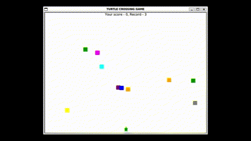

# Installation
No need to install any external packages. The game is built using standard library - "turtle"; 

```bash
python main.py
```
# Usage
Use your key "Up" move the trutel to safely cross the road. After reaching the end of the screen, the turtle will be moved back into initial position and speed of "cars" will be increased.


# Features
The game tracks current score and the best score (saved into .txt file)